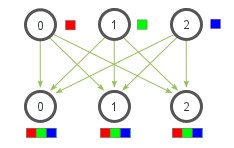
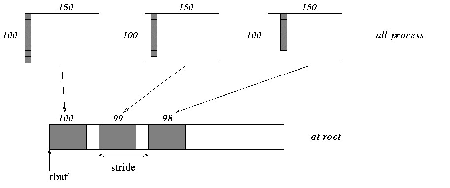

# MPI函数参考

## MPI_Allgather

从组的所有成员收集数据，并将数据发送到组的所有成员。原理查看下图，详细说明查看[MPI Scatter, Gather, and Allgather](https://mpitutorial.com/tutorials/mpi-scatter-gather-and-allgather/zh_cn/)：



```c++
int MPIAPI MPI_Allgather(
  _In_  void         *sendbuf,
  _In_  int          sendcount,
  _In_  MPI_Datatype sendtype,
  _Out_ void         *recvbuf,
        int          recvcount,
        MPI_Datatype recvtype,
        MPI_Comm     comm
);
```
参数
- sendbuf [in]
指向要发送到组中所有进程的数据的指针。 缓冲区中元素的数量和数据类型在 sendcount 和 sendtype 参数中指定。 缓冲区中的每个元素对应于组中的一个进程。
如果 comm 参数引用内部通信器，可以通过在所有进程中指定 MPI_IN_PLACE 来指定就地选项。 忽略 sendcount 和 sendtype 参数。 每个进程都会在相应的接收缓冲区元素中输入数据。 第 n个进程将数据发送到接收缓冲区的第 n个元素。

- sendcount [in]
sendbuf 参数中指定的缓冲区中的元素数。 如果 sendcount 为零，则消息的数据部分为空。

- sendtype [in]
发送缓冲区中元素的 MPI 数据类型。

- recvbuf [out]
指向包含从每个进程接收的数据的缓冲区的指针。 缓冲区中元素的数量和数据类型在 recvcount 和 recvtype 参数中指定。

- recvcount
接收缓冲区中的元素数。 如果计数为零，则消息的数据部分为空。

- recvtype
接收缓冲区中元素的 MPI 数据类型。

- 通讯
MPI_Comm通信器句柄。

## MPI_Gatherv

将组的所有成员的变量数据收集到一个成员。 MPI_Gatherv函数通过允许每个进程的不同数据计数，为MPI_Gather函数增添灵活性。原理查看下图，详细说明查看[Examples using MPI_GATHER, MPI_GATHERV](https://www.mpi-forum.org/docs/mpi-1.1/mpi-11-html/node70.html)：




```c++
int MPIAPI MPI_Gatherv(
  _In_      void         *sendbuf,
            int          sendcount,
            MPI_Datatype sendtype,
  _Out_opt_ void         *recvbuf,
  _In_opt_  int          *recvcounts[],
  _In_opt_  int          *displs[],
            MPI_Datatype recvtype,
            int          root,
            MPI_Comm     comm
);
```
参数
- sendbuf [in]
包含要发送到根进程的数据的缓冲区的句柄。
如果 comm 参数引用内部通信器，可以通过在所有进程中指定 MPI_IN_PLACE 来指定就地选项。 忽略 sendcount 和 sendtype 参数。 每个进程在相应的接收缓冲区元素中输入数据。 第 n个进程将数据发送到接收缓冲区的 n个元素。 假定根进程发送的数据位于接收缓冲区中的正确位置。

- sendcount
发送缓冲区中的元素数。 如果 sendcount 为零，则消息的数据部分为空。

- sendtype
缓冲区中每个元素的数据类型。

- recvbuf [out， optional]
根进程上缓冲区的句柄，其中包含从每个进程接收的数据，包括根进程发送的数据。 此参数仅在根进程中非常重要。 所有非根进程都会忽略 recvbuf 参数。

- recvcounts[] [in， 可选]
从每个进程接收的元素数。 数组中的每个元素对应于发送进程的排名。 如果计数为零，则消息的数据部分为空。 此参数仅在根进程中非常重要。

- displs[] [in， optional]
相对于每个通信器进程的数据 的 recvbuf 参数的位置。 从 process j 接收的数据将放入根进程偏移量的接收缓冲区中，从 sendbuf 指针分解 [j] 元素。
在 recvbuf、 recvcounts 和 displs 参数数组中，每个数组的第 n个元素是指从 n个通信器进程接收的数据。
此参数仅在根进程中非常重要。

- recvtype
缓冲区中每个元素的数据类型。 此参数仅在根进程中非常重要。

- root
指定通信器中的接收进程的排名。

- 通讯
MPI_Comm通信器句柄。

## MPI_Graph_create
使拓扑信息已附加到的新通信器。

```c++
int MPIAPI MPI_Graph_create(
        MPI_Comm               comm_old,
        int                    nnodes,
        _In_count_(nnodes) int *index,
  _In_  int                    *edges,
        int                    reorder,
  _Out_ MPI_Comm               *comm_cart
);
```

参数
- comm_old
没有拓扑的输入通信器。

- nnodes
图形中的节点数。

- index
描述节点度的整数数组。

- edges 边缘 [in]
描述图形边缘的整数数组。

- reorder 排序
排名可能会重新排序， (true) 或 (false) 。

- comm_cart [out]
添加了图形拓扑的 Communicator。


## MPI_Graph_neighbors_count
返回与图形拓扑关联的节点的邻居数。

```c++
int MPIAPI MPI_Graph_neighbors_count(
        MPI_Comm comm,
        int      rank,
  _Out_ int      *nneighbors
);
```
参数
- 通讯comm
具有图形拓扑的 Communicator。

- rank
进程组的排名。

- nneighbors [out]
指定进程的邻居数。

## MPI_Graph_neighbors 
返回与图形拓扑关联的节点的邻居。

```c++
int MPIAPI MPI_Graph_neighbors(
   MPI_Comm                    comm,
   int                         rank,
   int                         maxneighbors,
   _Out_cap_(maxneighbors) int *neighbors
);
```

参数
- comm
具有图形拓扑的 Communicator。

- rank
comm 组中的进程排名。

- maxneighbors
数组邻居的大小。

- neighbors
与指定进程相邻的进程排名。

## MPI_Neighbor_alltoall
MPI_Neighbor_alltoall是一个集合操作，所有进程向每个邻居发送和接收相同数量的数据。该例程的操作可以表示如下，其中每个进程执行2n (n是communicator comm中邻居的数目)独立的点对点通信。comm的拓扑结构决定了邻居和缓冲区的布局。
```c++
int MPIAPI MPI_Neighbor_alltoall(
  const void    *sendbuf, 
  int           sendcount,
  MPI_Datatype  sendtype, 
  void          *recvbuf, 
  int           recvcount,
  MPI_Datatype  recvtype, 
  MPI_Comm      comm
);
```

参数

- sendbuf
发送缓冲区的起始地址。
- sendcount
要发送给每个进程的元素数目(integer)。
- sendtype
发送缓冲区元素的数据类型(handle)。
- recvbuf
接收缓冲区的起始地址。
- recvcount
从每个进程接收的元素数目(integer)。
- recvtype
接收缓冲区元素的数据类型(handle)。
- comm
用于交换数据的通信器(handle)。

## MPI_Neighbor_alltoallv
MPI_Neighbor_alltoallv是一个集合操作，所有进程可以向每个邻居发送和接收不同数量的数据。该例程的操作可以表示如下，其中每个进程执行2n (n是communicator comm中邻居的数目)独立的点对点通信。comm的拓扑结构决定了邻居和缓冲区的布局。
```c++
int MPIAPI MPI_Neighbor_alltoallv(
  const void    *sendbuf, 
  const int     sendcounts[],
  const int     sdispls[],
  MPI_Datatype  sendtype, 
  void          *recvbuf, 
  const int     recvcounts[],
  const int     rdispls[],
  MPI_Datatype  recvtype, 
  MPI_Comm      comm
);
```

参数

- sendbuf
发送缓冲区的起始地址。
- sendcounts
非负整数数组，指定发送给每个邻居的元素个数
- sdispls
整数数组, 条目j指定了向邻居j发送数据的位移(相对于sendbuf)
- sendtype
发送缓冲区元素的数据类型(handle)。
- recvbuf
接收缓冲区的起始地址。
- recvcounts
非负整数数组，指定从每个邻居接收到的元素个数
- rdispls
整数数组，表项i指定了(相对于recvbuf)将来自邻居i的数据放置在哪个位置
- recvtype
接收缓冲区元素的数据类型(handle)。
- comm
用于交换数据的通信器(handle)。

## MPI_Neighbor_allgather
在该函数中，如果拓扑图中存在边(j,i)，则每个进程i从每个进程j收集数据项，如果存在边(i,j)，则每个进程i将相同的数据项发送给所有存在边(i,j)的进程j。发送缓冲区被发送到每个相邻进程，接收缓冲区中的第i个从第i个邻居接收。

```c++
int MPI_Neighbor_allgather(
  const void     *sendbuf, 
  int            sendcount, 
  MPI_Datatype   sendtype, 
  void           *recvbuf, 
  int            recvcount, 
  MPI_Datatype   recvtype, 
  MPI_Comm       comm
);
```
参数
- sendbuf
发送缓冲区的起始地址 (choice)
- sendcount
发送到每个邻居的元素数 (non-negative integer)
- sendtype
发送缓冲区元素的数据类型 (handle)
- recvbuf
接收缓冲区的起始地址 (choice)
- recvcount
从每个邻居接收到的元素个数 (non-negative integer)
- recvtype
接收缓冲区元素的数据类型 (handle)
- comm
通信域 (handle)

## MPI_Neighbor_allgatherv
MPI_Neighbor_allgather的向量版本。

```c++
int MPI_Neighbor_allgatherv(
  const void     *sendbuf, 
  int            sendcount, 
  MPI_Datatype   sendtype, 
  void           *recvbuf, 
  const int      recvcounts[], 
  const int      displs[],
  MPI_Datatype   recvtype, 
  MPI_Comm       comm
);
```
参数
- sendbuf
发送缓冲区的起始地址 (choice)
- sendcount
发送到每个邻居的元素数 (non-negative integer)
- sendtype
发送缓冲区元素的数据类型 (handle)
- recvbuf
接收缓冲区的起始地址 (choice)
- recvcounts
非负整数数组，包含从每个邻居接收到的元素个数
- displs
整数数组。项i指定了(相对于recvbuf)将来自邻居i的数据放置在哪个位置。
- recvtype
接收缓冲区元素的数据类型 (handle)
- comm
通信域 (handle)

##  MPI_Sendrecv_replace
使用单个缓冲区发送和接收。
```c++
int MPIAPI MPI_Sendrecv_replace(
        _Inout_ void *buf,
        int          count,
        MPI_Datatype datatype,
        int          dest,
        int          sendtag,
        int          source,
        int          recvtag,
        MPI_Comm     comm,
  _Out_ MPI_Status   *status
);
```
参数
- buf
发送和接收缓冲区的初始地址。

- count 计数
发送和接收缓冲区中的元素数。

- datatype
发送和接收缓冲区中的元素类型。

- dest
目标排名。

- sendtag
发送消息标记。

- source
源的排名。

- recvtag
接收消息标记。

- comm通讯
沟通。

- status [out]
Status 对象。

## MPI_Aint

相当于变量类型，可以一个位置在内存中的绝对地址。

## MPI_Get_address
获取内存中某个位置的地址。
```c++
int MPIAPI MPI_Get_address(
  _In_  void     *location,
  _Out_ MPI_Aint *address
);
```
参数
- location [in]
调用方内存中的位置。

- address [out]
位置地址。

## MPI_Aint_diff
产生一个新的`MPI_Aint`值，相当于`addr1`和`addr2`参数之间的差值，其中`addr1`和`addr2`表示调用`MPI_Get_address`返回的地址。
```c++
MPI_Aint MPI_Aint_diff(
  MPI_Aint addr1, 
  MPI_Aint addr2
);
```
参数
- addr1
被减数地址操作数
- addr2
减数地址

## MPI_Type_create_struct
为每个数据块定义具有指定数据类型、位移和大小的新数据类型。

```c++
int MPIAPI MPI_Type_create_struct(
        int                            count,
        _In_count_(count) int          array_of_blocklengths[],
        _In_count_(count) MPI_Aint     array_of_displacements[],
        _In_count_(count) MPI_Datatype array_of_types[],
  _Out_ MPI_Datatype                   *newtype
);
```
参数
- count
array_of_blocklengths中的块数和条目数，array_of_displacements和array_of_types参数。

- array_of_blocklengths
每个块的元素数。

- array_of_displacements
每个单独块的位移（以字节为单位）。

- array_of_types
每个块的数据类型。

- newtype [out]
返回时，包含表示新数据类型的MPI_Datatype句柄。

## MPI_Type_commit

提交数据类型。

```c++
int MPIAPI MPI_Type_commit(
  _In_ MPI_Datatype *datatype
);
```

参数
- datatype [in]
要提交的数据类型。