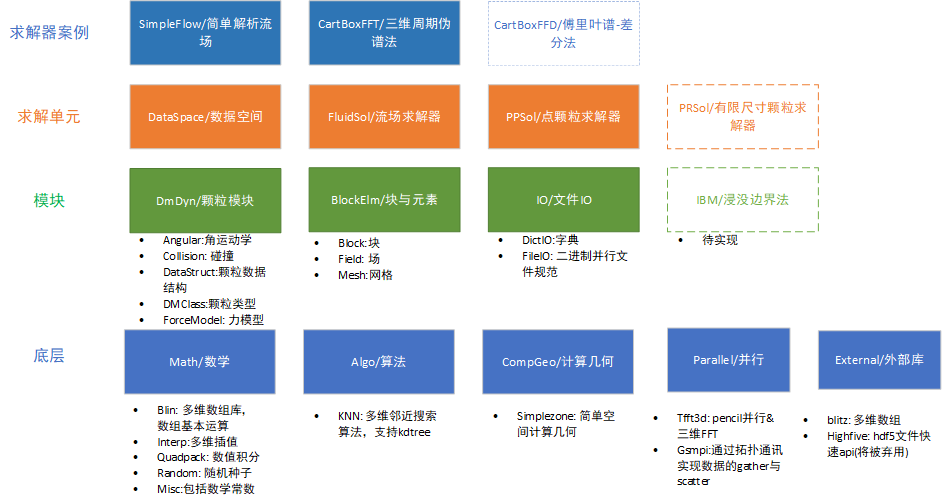

# PhyStar构建思路

## 运行模式

- PhyStar基于共享的DataSpace实现复杂的多物理场的耦合，即不同的求解模块操纵同一块数据空间。依次顺序执行，进而实现多场耦合。通常DataSpace包含了不同求解器之间公有数据，比如流场数据,网格数据等，其它求解器只是操纵这些数据。
- DataSpace数据共享由spaceID确定，具有相同SpaceID的求解器共享同一块内存。

## 层级结构

## 颗粒模型构造

